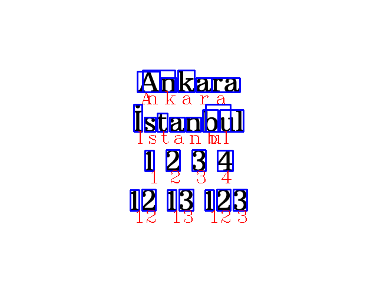

# Character Detection with OpenCV
Character, Word, and Number Detection on Images Using pytesseract, Also Implemented for Real-time Camera Feed

**Note:** When using pytesseract on Windows, it may encounter errors, 
in which case the folder containing Tesseract should be specified. An example code is provided below

```
pt.pytesseract.tesseract_cmd = "D:\\Program Files\\Tesseract-OCR\\tesseract.exe"
```
### Character Detection in Images:
 

### Word Detection in Images:
 

### Numbers Detection in Images:
 